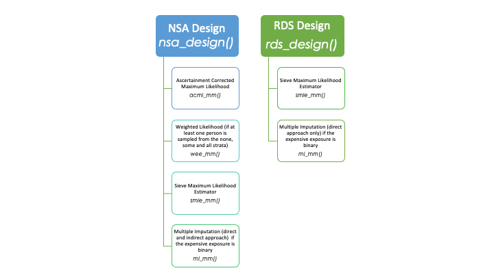
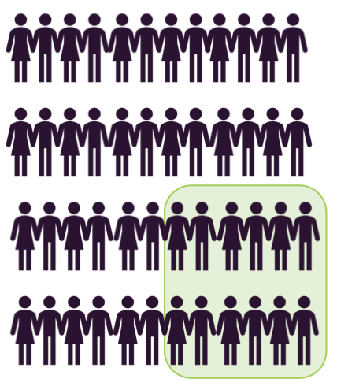

```{r, include = FALSE}
knitr::opts_chunk$set(
  collapse = TRUE,
  comment = "#>"
)
```

This vignette describes the `dames` R package, and provides examples on how to set up two designs, and implemented different analyses methods in two-phase studies with binary longitudinal data. The package aims to facilitate the use of two-phase outcome-dependent sampling (ODS) designs by providing: (1) a set of functions for selecting individuals to include in the study (design functions), and (2) a set of functions for estimating the parameters (analysis functions). Notes and background information on the designs and methods presented in this vignette can be found at the end of the document.

# Basic Example

```{r setup, message=FALSE, warning=FALSE}
# for the design and analysis methods
library(dames)
# for plot and data cleaning
library(tidyverse)
library(viridis)
```

## The Data

The dataset used in this vignette is stored in the `dames` package under the name `exampledat`. The dataset was randomly generated from the model:

$$logit(\mu_{ij}^m) = -2 + X_{i} + 0.15T_{ij} + 0.25Z_i + 0.15 X_i T_{ij}$$

$$logit(\mu_{ij}^c) = \Delta_{ij} + 2 Y_{i(j-1)}$$

where $i = 1, ..., 1,000$ indicates subject $i$, $X_i$ and $Z_i$ are binary time-fixed covariates and $T_{ij}$ is a time-varying covariates indicating visit time (each subject $i$ is observed three to six times).

```{r dataload}
str(exampledat)
```

For the remaining part of this vignette we are going to assume that:

* $X$ is an expensive exposure that needs to be collected using a two-phase ODS design.

* $Y$ and $Z$ are inexpensive outcome and covariate respectively that are available for the 1,000 subjects in the dataset.

**Note: all functions in the package support the data.frame class only. Tibbles are not currently supported.**

## The Design Functions

`dames` allows users to perform two broad classes of two-phase ODS designs: the none-some-all (NSA) designs introduced by @Schildcrout2008 and the residual dependent sampling (RDS) designs introduced by Di Gravio et al **(CITE)**. Broadly, these two classes use a different amount of information to identify individual from whom the expensive exposure $X$ needs to be collected: the NSA designs accounts for the available outcome $Y$ only, whereas the RDS designs include information on all available covariates $Z$ and outcome $Y$. Detailed information on each design can be found at the end of this vignette, and in @Schildcrout2008 and **CITE**. 

NSA designs can be performed using the function `nsa_design()`.The function requires the following inputs:

  - `Y`: the name of the column storing the outcome value in the dataframe
  
  - `id`: the name of the column storing the subject indicator in the dataframe
  
  - `n.sample`: a vector with three elements indicating how many subjects we want to sample from the none, the some and the all stratum respectively
  
  - `data`: the name of the dataframe that includes at least two columns named `Y` and `ìd`
  
  The function will output a list with three elements:
  
  - `sampled.id`: vector of subjects id to sample for expensive exposure ascertainment 
  
  - `sample.probs`: vector of sampling probabilities from the none, some, and all strata respectively. 
  
  - `n.stratum`: vector specifying the total (sampled and unsampled) number of subjects in the none, some, and all strata respectively
  
  - `membership`: vector specifying the stratum membership to each subject id. Note that `membership` is ordered as the vector `id`.
  
Below is an example of how the function `nsa_design()` can be used. Here we want to sample 85 people from the none stratum, 100 people from the some stratum and 15 people. Note, since within each of the three strata independent Bernoulli sampling is performed, it is not unusual to have a total number of sampled subjects being different than 200.
  
```{r nsadesign}
nsa_design(Y = "Y", id = "id", 
           n.sample = c(85, 100, 15), data = exampledat)
```

RDS designs can be performed with the function `res_design()`. The function requires the following input:

  - `Y`: the name of the column storing the outcome value in the dataframe `data`
  
  - `id`: the name of the column storing the subject indicator in the dataframe `data`
  
  - `mean.formula`: formula for the marginal mean model in which a binary longitudinal outcome is regressed on a set of covariates. 
  
  - `t.formula`: formula for the transition part of the dependence model
  
  - `lv.formula`: formula for the latent part of the dependence model.
  
  - `n.sample`: number of subjects to be sampled for expensive exposure ascertainment
  
  - `statistic`: name of the statistic to be used to perform the RDS sampling. Currently, the statistics supported are the mean, the absolute value of the mean, and the variance of the residuals of the residuals.
  
   - `data`: the name of the dataframe. `data` should include all variables specified in `mean.model`, `t.model`, `lv.model` as well as two columns named `Y` and `ìd`
  
  The function will output a list with one element:
  
  - `sampled.id`: vector of subjects id to sample for expensive exposure ascertainment 
  
Below is an example of how the function `res_design()` can be used. Here we want to sample 200 people with the highest absolute value of the mean of the residuals:
  
```{r resdesign}
res_design(Y = "Y", id = "id", 
           mean.formula = Y ~ Z + time, t.formula = ~1, lv.formula = NULL,
           n.sample = 200, statistic = "abs.mean", data = exampledat)
```

  
## The Inference Functions

Inference methods can be divided into two groups: methods that only include subjects with complete data on outcome $Y$, expensive exposure $X$ and inexpensive covariates $Z$ (complete-case analyses), and methods that include all subjects regardless of whether they have information on the expensive exposure $X$ (full-cohort analyses).

The `dames` package allows users to perform both complete-case and full-cohort analyses. For the NSA designs, user can choose between two complete-case analyses and two-full cohort analyses:

* *Complete Case Analyses*
  
  - _Ascertainment Corrected Maximum Likelihood Estimator (@Schildcrout2008)._ The method can be used regardless of the type of expensive exposure (i.e., nominal or continuous). 

  - _Weighted Maximum Likelihood Estimator (@Cai2001)._ The method can be used regardless of the type of expensive exposure (i.e., nominal or continuous). The method can be implemented as long as every subject has a non-zero probability of being sampled; thus, it cannot be implemented for the RDS designs described in this R package.

* *Full-Cohort Analyses*

  -  _Multiple Imputation (@Schildcrout2015)._ Two MI methods are implemented. Both methods support binary expensive covariates only.

  -  _Sieve Maximum Likelihood Estimator (@Tao2017 and **CITE**)._ The method can be used regardless of the type of expensive exposure (i.e., nominal or continuous).

For the RDS designs, users can select the sieve maximum likelihood estimator or one of the multiple imputation methods. Details on each methods, together with references, are presented at the end of the document. In this vignette we are going to show how to impalement different analysis for an NSA design.

```{r}
# perform the NSA design
design       <- nsa_design(Y = "Y", id = "id", n.sample = c(85, 100, 15),
                           data = exampledat)
# Assume X is not collected for subjects not sampled
exampledat$X <- ifelse(exampledat$id %in% design$sampled.id, exampledat$X, NA)
```

### Complete Case Analyses 

#### ACML

The ascertainment corrected likelihood estimator is implemented in the `acml_mm()` function. The function requires at least the following input (other inputs have default values that can be changed):

  - `mean.formula`: formula for the marginal mean model in which a binary longitudinal outcome is regressed on a set of covariates. 
  
  - `t.formula`: formula for the transition part of the dependence model.
  
  - `lv.formula`: formula for the latent part of the dependence model.
  
  - `id`: vector of ids taken from the dataframe `data`.
  
  - `samp.probs`: vector of three values indicating the sampling probabilities from the none, some and all strata.
  
   - `data`: the name of the dataframe. `data` should include all variables specified in `mean.model`, `t.model`, `lv.model`.
  
The function will output a list with different elements that can be viewed using the `summary` function.
  
  
```{r acml}
# estimate the parameters using ACML
mod.acml    <- acml_mm(mean.formula = Y ~ X + time + Z + X:time,
                       t.formula = ~1,
                       id = id, samp.probs = design$sample.probs,
                       data = exampledat)
# print the results
summary(mod.acml)
```

#### Weighted Likelihood

The weighted likelihood estimator is implemented in the `wee_mm()` function. The function requires at least the following input (other inputs have default values that can be changed):

  - `mean.formula`: formula for the marginal mean model in which a binary longitudinal outcome is regressed on a set of covariates. 
  
  - `t.formula`: formula for the transition part of the dependence model.
  
  - `lv.formula`: formula for the latent part of the dependence model.
  
  - `id`: vector of ids taken from the dataframe `data`.
  
  - `weights`: vector of weights for the likelihood estimation. The length vector needs to be equal to the number of rows in `data`.
  
   - `data`: the name of the dataframe. `data` should include all variables specified in `mean.model`, `t.model`, `lv.model`.
  
The function will output a list with different elements that can be viewed using the `summary` function.

```{r wee}
# vector of sampling probabilities per subject
samp.probs <- ifelse(design$membership == "None", design$sample.probs[1], 
                     ifelse(design$membership == "Some", design$sample.probs[2], 
                            design$sample.probs[3]))
# number of times each subject is observed
time_i     <- exampledat %>% group_by(id) %>% summarise(mi = n()) %>% pull()
# repeat the sampling probability for each subject based on the number
# of times a subject is observed
exampledat$samp.probs <- rep(samp.probs, time_i)
samp.probs            <- exampledat[!is.na(exampledat$X),"samp.probs"]


# estimate the parameters using WEE
mod.wee    <- wee_mm(mean.formula = Y ~ X + time + Z + X:time,
                      t.formula = ~1,
                      id = id, weights = 1/samp.probs,
                      data = exampledat)
# print the results
summary(mod.wee)
```

### Full Cohort Analysis

#### Multiple Imputation

Multiple Imputation is implemented in the `mi_mm()` function. There are two options for multiple imputations that are specified using the `method` argument. The function requires at least the following input (other inputs have default values that can be changed):

  - `mean.formula`: formula for the marginal mean model in which a binary longitudinal outcome is regressed on a set of covariates. 
  
  - `t.formula`: formula for the transition part of the dependence model.
  
  - `lv.formula`: formula for the latent part of the dependence model.
  
  - `id`: the name of the column storing the subject indicator in the dataframe `data`.
  
  - `X`: the name of the column storing the expensive exposure in the dataframe `data`.

  - `Sampled`: the name of the column in the dataframe `data` storing an indicator variable on whether the subject has been sampled. Only required for the indirect MI approach.
  
   - `data`: the name of the dataframe. `data` should include all variables specified in `mean.model`, `t.model`, `lv.model`, `id`, `X`, and `Sampled`. Note that only the column corresponding to the expensive covariate `X` can include missing values.
   
   - `samp.probs`: vectors of sampling probabilities from the none, some and all strata. The argument is used only when `method = indirect`. Sampling probabilities do not need to be specified when `method = direct`.
   
   - `marg.exp.formula`: marginal exposure model for the imputation model.
   
   - `M`: number of multiply imputed datasets.
   
   - `method`: MI method (can be either `indirect` or `direct`).
  
The function will output a list with different element that can be viewed using the `summary` function. For the indirect MI approach we have:

```{r mi1}
# define an indicator variable for sampling
exampledat$Sampled <- ifelse(exampledat$id %in% design$sampled.id, 1, 0)
# estimate the parameters using Indirect MI
mod.mi1 <- mi_mm(mean.formula = Y ~ X + time + Z + X:time,
                 t.formula = ~1,
                 lv.formula = NULL, id = "id", X = "X",
                 sampled = "Sampled",
                 data = exampledat,
                 samp.probs = design$sample.probs,
                 marg.exp.formula = X ~ Z, M = 5, method = "indirect")
# print the results
summary(mod.mi1)
```


While for the direct MI approach we have:

```{r mi2}
# estimate the parameters using Direct MI
mod.mi2 <- mi_mm(mean.formula = Y ~ X + time + Z + X:time,
                 t.formula = ~1,
                 lv.formula = NULL, id = "id", X = "X",
                 data = exampledat,
                 marg.exp.formula = X ~ Z, M = 5, method = "direct")
# print the results
summary(mod.mi2)
```

#### SMLE

The sieve maximum likelihood estimator is implemented in the `smle_mm()` function. The function requires at least the following input (other inputs have default values that can be changed):

  - `mean.formula`: formula for the marginal mean model in which a binary longitudinal outcome is regressed on a set of covariates. 
  
  - `t.formula`: formula for the transition part of the dependence model
  
  - `lv.formula`: formula for the latent part of the dependence model.
  
  - `id`: the name of the column storing the subject indicator in the dataframe `data`.
    
  - `Y`: the name of the column storing the outcome in the dataframe `data`.
  
  - `X`: the name of the column storing the expensive exposure in the dataframe `data`.
  
  - `Z`: vector of column names storing the inexpensive covariates in the dataframe `data`.
  
  - `Time`: the name of the column storing the time variable in the dataframe `data`.
  
  - `Bspline`: matrix of B-spline basis for the approximation with method of sieves.
  
  - `n_sieve`: total umber of sieves,
  
  - `no_SE`: indicator of whether the coefficients' standard errors need to be computed
  
   - `data`: the name of the dataframe. `data` should include all variables specified in `mean.model`, `t.model`, `lv.model`, `id`, `Y`, `X`, `Z`, and `Time`. Note that only the column corresponding to the expensive covariate `X` can include missing values.
  
The function will output a list with different elements that can be viewed using the `summary` function.

```{r smle}
# set up P(X|Z)
Bspline_Z <- cbind(as.numeric(exampledat$Z == 0), 
                   as.numeric(exampledat$Z == 1))
n_sieve             <- ncol(Bspline_Z)
colnames(Bspline_Z) <- paste("bs", 1:n_sieve, sep="")
exampledat          <- cbind(exampledat, Bspline_Z)
# estimate the parameters using SMLE
mod.smle <- smle_mm(mean.formula = Y ~ X + time + Z + X:time,
                    t.formula = ~1, lv.formula = NULL,
                    Y = "Y", X = "X", Z = "Z", Time = "time",
                    id = "id", Bspline = Bspline_Z, n_sieve = n_sieve, no_SE = FALSE,
                    data = exampledat)
summary(mod.smle)
```

# Overview of the package

In total, there are six main functions and one dataset in the package that available to the user. The main functions are summarized in the table below.


| Name                  | Function and Outcome Description                                                             |
|-----------------------|----------------------------------------------------------------------------------------------|
| $\texttt{nsa_design}$ | Function to perform NSA designs. Returns a list with three elements: 1) vector of IDs to be sampled for expensive exposure ascertainment, 2) vector of sampling probabilities of the none, some and all strata respectively, and 3) vector of sample sizes of the none some and all strata respectively  |
| $\texttt{res_design}$ | Function to perform RDS designs. Currently, sampling based on the mean, the absolute value of the mean or the variance of the residuals are implemented. Returns the vector of IDs to be sampled for expensive exposure ascertainment. |
| $\texttt{acml_mm}$    | Ascertainment corrected maximum likelihood estimator. `acml_mm` can only be used for NSA designs. Returns the estimated coefficients, standard errors, and other summaries from the model fitting function. This is an object of class `TwoPhaseMM`. |
| $\texttt{wee_mm}$     | Weighted likelihood estimator. `wee_mm` can only be used for NSA designs. Returns the estimated coefficients, standard errors, and other summaries from the model fitting function. This is an object of class `TwoPhaseMM`. |
| $\texttt{smle_mm}$    | Sieve maximum likelihood estimator. `smle_mm` can be used for NSA and RDS designs. Returns the estimated coefficients, standard errors, and other summaries from the model fitting function. This is an object of class `TwoPhaseMM`. |
| $\texttt{mi_mm}$    | Estimate the model coefficients using multiple imputation. Two approaches are implemented: direct and indirect. The direct approach can be used for NSA and RDS designs. The indirect approach can be used for NSA design only. Returns the estimated coefficients, standard errors, and other summaries from the model fitting function. This is an object of class `TwoPhaseMM`. |

Note that not all analysis methods can be used for both designs. The graph below shows which analysis methods can be used for each design.

<div style= "float:right;position: relative; padding:50px;">
{width=20%,height=20%}
</div>


# Notes on Methodology

## Common Notation

* $\mathbf{Y}_i \equiv (Y_{i,1}, ..., Y_{i,m_i})$: $m_i$-vector of binary responses for subject $i$.

* $\mathbf{X}_i$: $m_i \times p$ matrix of expensive exposures.

* $\mathbf{Z}_i$: $m_i \times q$ matrix of inexpensive covariates.

* $N$: total number of subjects in the phase one cohort (i.e., total number of subjects with available information on outcome and inexpensive covariates).

* $n_2$: total number of subjects for whom the expensive exposures are measured.

* $S_i$: sampling indicator for subjects $i$ such that $S_i = 1$ if subject $i$ was selected for phase two exposure ascertainment and $S_i = 0$ otherwise.

* $\boldsymbol{\theta}$: set of parameters of interest.

## Marginalized Transition and Latent Variable Model

Let $U_i \sim N(0, 1)$, the marginalized transition and latent variable (mTLV) model described in @schildcrout2007mtlv can be defined by two equations:

$$logit\left(\mu_{i,j}^m\right) = \beta_0 + \boldsymbol{\beta_x}^T\mathbf{X}_i + \boldsymbol{\beta_z}^T\mathbf{Z}_i$$
$$logit\left(\mu_{i,j}^c\right) = \Delta_{i,j}(\mathbf{X}_i, \mathbf{Z}_i) + \gamma(\mathbf{X}_i, \mathbf{Z}_i)Y_{i,j-1} + \sigma(\mathbf{X}_i, \mathbf{Z}_i) U_i$$
describing the marginal mean and the dependence model, respectively. In particular:

* the marginal mean model, $\mu_{i,j}^m = E[Y_{i,j}|\mathbf{X}_i, \mathbf{Z}_i]$ describes the relationship between the outcome and the covariates;

* the dependence model, $\mu_{i,j}^c = E[Y_{i,j}|\mathbf{X}_i, \mathbf{Z}_i, U_i, Y_{i(j-1)}]$ describes the relationship between the measured outcomes for each subject $i$. The dependence model can include a short-term transition component, $\gamma(\mathbf{X}_i, \mathbf{Z}_i)Y_{i,j-1}$, and a longer range dependence term described by a standard normal random effect $U_i$.

* $\Delta_{ij}(\mathbf{X}_i, \mathbf{Z}_i)$ is a function of $\mu_{i,j}^m$ and  $\mu_{i,j}^c$ such that the marginal and the conditional models are cohesive. Once $\Delta_{i,j}(\boldsymbol{X}_i)$ is computed the parameters of the model $\boldsymbol{\theta} = (\beta_0, \boldsymbol{\beta_x}, \boldsymbol{\beta_z}, \gamma(\mathbf{X}_i, \mathbf{Z}_i), \sigma(\mathbf{X}_i, \mathbf{Z}_i))$ can be computed by maximizing the likelihood:

$$L(\theta; \mathbf{Y}, \mathbf{Z}, \mathbf{X}) \prod_{i = 1}^N \int \left\{\prod_{j = 1}^{m_i}\left(\mu_{i,j}^c\right)^{y_{i,j}}\left(1-\mu_{i,j}^c\right)^{(1 - y_{i,j})} \right\}\phi(u_i)du_i$$
where $\phi$ is the standard normal probability density function.

Additional information on mTLV models can be found in @schildcrout2007mtlv , @heagerty1999mlv and @heagerty2002mt.

## The Designs

<div style= "float:right;position: relative; padding:30px;">
{width=15%,height=8%}
</div>

Suppose researchers are interested in understanding the relationship between a readily available longitudinal outcome and a novel expensive to collect exposure. Two-phase ODS designs are a pragmatic solution that allow researchers to target informative individuals for expensive exposure ascertainment. 

Briefly, in a two-phase ODS design, the longitudinal outcome and a set of inexpensive covariates are observed for all subjects in a **phase one** (the purple people in the picture). Then, based on the observed outcome and/or inexpensive covariates, a subset of subjects (the green set in the picture) is chosen for a **phase two**. Only subjects selected for phase two will have the expensive exposure measured. 

The idea behind a two-phase designs is to increase efficiency of the estimated model's parameters by maximizing the observed response variability. For instance, when we have a binary cross-sectional outcome, a case-control study with the same number of cases and controls is the most efficient design. Extensions to longitudinal binary data need to account for two sources of variability:

* within-subject variability; i.e., how the outcome and covariates values change for a subject throughout the study

* between-subject variability; i.e., how the outcome and covariates values change across each subject


### The None-Some-All (NSA) Design

@Schildcrout2008 introduced the NSA design which identifies informative individuals based on a summary of their outcome vector $\boldsymbol{Y}_{i}$. Specifically, for each subject $i$, the NSA design computes the sum of their outcome vector, $\sum_{j = 1}^{m_i}Y_{i,j}$, and classifies them in one of the three strata:

* **None Stratum**: people who never experienced the outcome $\left(\sum_{j = 1}^{m_i}Y_{i,j} = 0\right)$

* **Some Stratum**: people who experienced the outcome at some point during the study but not always$\left(0 < \sum_{j = 1}^{m_i}Y_{i,j} < m_i\right)$

* **All Stratum**: people who always experienced the outcome $\left(\sum_{j = 1}^{m_i}Y_{i,j} = m_i\right)$

The graphical representation below helps us see how the outcome changes over time for subjects in the none, some and all strata

```{r, message=FALSE, echo=FALSE, fig.width=8, fig.height=5,fig.retina=3}

exampledat <- exampledat %>% group_by(id) %>%
  mutate(mY = mean(Y), stratum = ifelse(mY == 0, "None",
                                        ifelse(mY == 1, "All", "Some")))
exampledat$stratum <- factor(exampledat$stratum, levels = c("None", "Some", "All"),
                             ordered = TRUE)
ggplot(exampledat, aes(x = time, y = id, fill = factor(Y))) + geom_tile() + 
  scale_fill_viridis(discrete = TRUE, begin = 0.1, end = 0.9, 
                     name = "Outcome Level") + 
  facet_wrap(stratum~.) +
  theme_bw() + theme(legend.position = "bottom")
```

@Schildcrout2008 demonstrated how efficiency of the estimated model's parameters can be increased by sampling from each of the three strata with different probabilities. Specifically:

* if interest lies in making inference on coefficients associated with time-varying covariates, then one should assign to subjects in the some stratum a higher probability of being sampled. The optimal NSA design for time-varying covariates assigns a probability of being sampled equal to 1 to subjects in the some stratum, and equal to 0 to subjects in the all and none strata.

* If interest lies in making inference on coefficients or associated with time-fixed covariates, then one should sample subjects from the none, some and all strata with non-zero probability. However, the optimal NSA design is unknown.

### The Residual Dependent Sampling (RDS) Designs 

Differently from the NSA designs, residual dependent sampling (RDS) designs use information on both the outcome and inexpensive covariates in the sampling scheme. Ideally, adding information on the expensive covariates can increase the precision of estimated coefficients (@Breslow1999, @Borgan2000). Di Gravio et al **CITE** introduced RDS designs for binary longitudinal outcomes which identify informative individuals based on a summary of their outcome vector $\mathbf{Y}$ and inexpensive covariates $\mathbf{Z}$. The RDS designs are based on the following steps:

1. Fit a mTLV model that excludes the expensive covariates:

$$logit(\mu_{i,j}^{m*}) = \beta_0^{*} + \boldsymbol{\beta}_z^{*^T}\mathbf{Z}_i$$

$$logit(\mu_{i,j}^{c*}) = \Delta_{ij}(\mathbf{Z}_i) + \gamma^{*}(\mathbf{Z}_i)  Y_{i,j-1} + \sigma^{*}(\mathbf{Z}_i)  U_i$$

2. Compute $\widehat{\mu}_{ij}^{m*} = \frac{exp \left(\hat{\beta}_0^{*} + \widehat{\boldsymbol{\beta}}_z^{*T}\mathbf{Z}_i \right)}{1 + exp \left(\hat{\beta}_0^{*} + \widehat{\boldsymbol{\beta}}_z^{*T}\mathbf{Z}_i \right)}$

3. Compute $\widehat{\epsilon}_{ij} = Y_{i,j} - \widehat{\mu}_{i,j}^{m*}$ for each subject $i$ at time $j$

4. For each subject $i$ compute a summary of $\widehat{\epsilon}_{ij}$. 

Increased efficiency of the estimated model’s parameters can be observed by sampling based on a subject-specific summary of $\widehat{\epsilon}_{ij}$:

* If interest lies in making inference on coefficients associated with time-varying covariates, one should sample subjects with the highest value of the within-subject' variance of $\widehat{\epsilon}_{ij}$.

* if interested lies in making inference on coefficients associated with time-fixed covariates, one should sample subjects with the highest absolute value of the mean of $\widehat{\epsilon}_{ij}$ or those with the highest and lowest value of the mean of $\widehat{\epsilon}_{ij}$. These two designs are different under most circumstance as the distribution of  $\widehat{\epsilon}_{ij}$ is usually not symmetric around zero.

## The Estimation Procedures

### Complete-Case Analyses

#### Weighted Estimating Equation (WEE)

The WEE estimator (@Cai2001) computes the parameters of interest by weighting the contribution to the likelihood of each subjects with complete information on outcome, exposure and inexpensive covariates by the inverse of their respective probability of being sampled for expensive exposure ascertainment. Thus, the contribution to the likelihood for each subject $i$ is given by:

$$
\frac{1}{P(S_i = 1 | \mathbf{Y}_i, \mathbf{Z}_i, \mathbf{X}_{i})} \text{log}(L(\boldsymbol{\theta}; \mathbf{Y}_i, \mathbf{X}_i, \mathbf{Z}_i))
$$

where $P(S_i = 1 | \mathbf{Y}_i, \mathbf{Z}_i, \mathbf{X}_{i})$ is the probability of being sampled for expensive exposure ascertainment. Note that in two-phase ODS designs, $P(S_i = 1 | \mathbf{Y}_i, \mathbf{Z}_i, \mathbf{X}_{i})$ is known as it is set by the researcher in the design phase. The parameter $\boldsymbol{\theta}$ is estimated by solving:

$$
U(\boldsymbol{\theta}) = \sum_{i = 1}^N \frac{1}{P(S_i = 1 | \mathbf{Y}_i, \mathbf{Z}_i, \mathbf{X}_{i})}  \frac{\partial}{\partial \mathbf{\theta}} \text{log}(L(\boldsymbol{\theta}; \mathbf{Y}_i, \mathbf{X}_i, \mathbf{Z}_i))
$$

The covariance matrix is of the form $A^{-1} B (A^{-1})^T$ where $A = E[U'(\boldsymbol{\theta})]$ and $B = E[U(\boldsymbol{\theta})U(\boldsymbol{\theta})^T]$.


#### Ascertainment Corrected Maximum Likelihood (ACML)

When subjects sampled for expensive exposure ascertainment are selected using an NSA design, @Schildcrout2008 proposed to estimate $\boldsymbol{\theta}$ by maximizing an ascertainment-corrected log-likelihood that explicitly conditions on being sampled for exposure ascertainment in phase two. The ACML approach maximizes the log-likelihood:

$$
\sum_{i = 1}^{n_2}\text{log} P(\mathbf{Y}_i| S_i = 1, \mathbf{X}_{i}, \mathbf{Z}_i; \boldsymbol{\theta}) = \sum_{i = 1}^n \text{log}\frac{P(S_i = 1 | \mathbf{Y}_i, \mathbf{Z}_i, \mathbf{X}_{i})P(\mathbf{Y}_i | \mathbf{X}_{i}, \mathbf{Z}_i; \boldsymbol{\theta})}{P(S_i = 1 | \mathbf{X}_{i}, \mathbf{Z}_i)} = \\ \sum_{i = 1}^n \left\{ \text{log}\frac{P(S_i = 1 | \mathbf{Y}_i, \mathbf{Z}_i, \mathbf{X}_{i})}{P(S_i = 1 | \mathbf{X}_{i}, \mathbf{Z}_i)} + P(\mathbf{Y}_i | \mathbf{X}_{i}, \mathbf{Z}_i; \boldsymbol{\theta} ) \right\}
$$
$P(S_i = 1 | \mathbf{Y}_i, \mathbf{Z}_i, \mathbf{X}_{i})$ is the known probability of being sampled for phase two and $P(S_i = 1 | \mathbf{X}_{i}, \mathbf{Z}_i)$ is a correction factor that account for the biased sampling scheme. For any NSA design,  $P(S_i = 1 | \mathbf{X}_{i}, \mathbf{Z}_i)$ can be written as:

$$
\sum_{v = 0}^2P(S_{i} = 1, V = v | \mathbf{X}_{i}, \mathbf{Z}_i) = \sum_{v = 0}^2 \pi_1(v)P(V_i = v | \mathbf{X}_{i}, \mathbf{Z}_i)
$$

where $V_i = v = 0, 1, 2$ for subjects in the none, some and all stratum respectively, and $\pi_1(v)$ is the probability of being sampled from stratum $v$. Given the likelihood above, the parameter $\boldsymbol{\theta}$ can be estimated using a Newton-Raphson approach. Additional details on the ACML can be found in @Schildcrout2008.

### Full-Cohort Analyses

#### Sieve Maximum Likelihood Estimator (SMLE)

The SMLE implemented in `dames` extends the work of @Tao2017 to accommodate a binary longitudinal outcome. The SMLE models the outcome the distribution of the outcome given expensive exposures and inexpensive covariates, $P(\mathbf{Y}_i | \mathbf{X}_i, \mathbf{Z}_i; \boldsymbol{\theta})$, parametrically and the conditional distribution of the expensive exposure given the inexpensive covariates, $G(\mathbf{X}_i | \mathbf{Z}_i)$, non-parametrically using the methods of sieves in @Grenander1981 and B-splines basis.

The SMLE a flexible full-cohort analysis method that can be implemented for NSA and RDS designs. The observed data log-likelihood used in the SMLE can be written as the sum of the contributions from subjects selected in phase two with data on $(\mathbf{Y}_i, \mathbf{X}_i,\mathbf{Z}_i)$ and the contributions of subjects not selected in phase two with data on $(\mathbf{Y}_i, \mathbf{Z}_i)$ only:

$$
\begin{align}
l^{obs}(\boldsymbol{\theta}, G) &= \sum_{i = 1}^N S_i \{\text{log} P(\mathbf{Y}_i | \mathbf{X}_i, \mathbf{Z}_i; \boldsymbol{\theta})G(\mathbf{X}_i | \mathbf{Z}_i) \} \\ &+ \sum_{i = 1}^N(1-S_i)\left\{\text{log} \int_{x} P(\mathbf{Y}_i|\mathbf{x}, \mathbf{Z}_i; \boldsymbol{\theta})G(\mathbf{x}| \mathbf{Z}_i)d\mathbf{x}\right\}.
\end{align}
$$
Let $B_{j}^q(\mathbf{Z}_i)$ be the $j$th B-spline function of degree $q$, $s_n$ the size of B-spline bases, and $p_{kj}$ be the coefficient associated with $B_{j}^q(\mathbf{Z}_i)$ at $\mathbf{x}_k$, the observed data log-likelihood can be written as:

$$
\begin{align}
l^{obs}(\boldsymbol{\theta}, p_{kj}) &= \sum_{i = 1}^N S_i \left \{\text{log} P(\mathbf{Y}_i | \mathbf{X}_i, \mathbf{Z}_i; \boldsymbol{\theta}) + \sum_{k = 1}^m I(\mathbf{X}_i = \mathbf{x}_k)\sum_{j = 1}^{s_n}B_j^q(\mathbf{Z}_i)logp_{kj} \right \} \\ &+ \sum_{i = 1}^N(1-S_i)\left\{\text{log} \sum_{k = 1}^m P(\mathbf{Y}_i|\mathbf{x}_k, \mathbf{Z}_i; \boldsymbol{\theta})\sum_{j = 1}^{s_n}B_j^q(\mathbf{Z}_i)p_{kj}\right\}.
\end{align}
$$
The parameters of interest $\boldsymbol{\theta}$ can be estimated using the EM algorithm to maximize $l^{obs}(\boldsymbol{\theta}, p_{kj})$ under the constraints $\sum_{k = 1}^mp_{kj} = 1$ and $p_{kj} \geq 0$, $\forall i,j$. Additional details on the SMLE and the EM algorithm can be found in @Tao2017 and **CITE**.

#### Multiple Imputation

Given that the missing information on the expensive exposure $\mathbf{X}$ in subjects not sampled in phase two depends on observed outcome $\mathbf{Y}$ and inexpensive covariates $\mathbf{Z}$ only, the following equality holds:


\begin{equation}\tag{1}
P(\mathbf{X}_i | \mathbf{Z}_i, \mathbf{Y}_i, S_i = 0) = P(\mathbf{X}_i | \mathbf{Z}_i, \mathbf{Y}_i) = P(\mathbf{X}_i | \mathbf{Z}_i, \boldsymbol{Y}_i, S_i = 1).
\end{equation}

Thus,one can use the available data from those sampled in phase two (i.e., subjects with $S_i = 1$) with complete information on $(\mathbf{Y}, \mathbf{X},\mathbf{Z})$ to build an imputation model $P(\mathbf{X}_i | \mathbf{Z}_i, \mathbf{Y}_i, S_i = 0)$ for those subjects not sampled for phase two. 

The `dames` package implements the indirect multiple imputation (MI) approach described in @Schildcrout2015. The indirect MI approach requires the expensive exposure $\mathbf{X}$ to be a binary variable, and can only be used for NSA designs.

**Indirect Multiple Imputation**

The indirect MI approach combines the ACML procedure with an exposure model for $G(\mathbf{X}_i | \mathbf{Z}_i, S_i = 1)$. Given the equality in equation (1), and a single binary expensive exposure $X$, one can use the Bayes' theorem to build the imputation model:

$$
\begin{aligned}
\text{log}\left\{\frac{P(X_i = 1| \mathbf{Z}_i, \mathbf{Y}_i, S_i = 0)}{P(X_i = 0| \mathbf{Z}_i, \mathbf{Y}_i, S_i = 0)}\right\} &=\text{log}\left\{ \frac{P(\mathbf{Y}_i|X_i = 1, \mathbf{Z}_i, S_i = 1)}{P(\mathbf{Y}_i|X_i = 0, \mathbf{Z}_i, S_i = 1)}\right\} + \text{log}\left\{\frac{G(X_i = 1| \mathbf{Z}_i, S_i = 1)}{G(X_i = 0| \mathbf{Z}_i, S_i = 1)}\right\} \\
&= \text{log}\left\{\frac{P(\mathbf{Y}_i|X_i = 1, \mathbf{Z}_i, S_i = 1)}{P(\mathbf{Y}_i|X_i = 0, \mathbf{Z}_i, S_i = 1)}\right\} \\&+ \left[\text{log}\left\{ \frac{P(S_i = 1 | X_i = 1, \mathbf{Z}_i)}{P(S_i = 1 | X_i = 0, \mathbf{Z}_i)} \right\} + \text{log}\left\{\frac{G(X_i = 1|\mathbf{Z}_i)}{G(X_i = 0|\mathbf{Z}_i)}\right\}\right]
\end{aligned}
$$

The imputation model combines two terms:

1. $\text{log}\left\{ \frac{P(\mathbf{Y}_i|X_i = 1, \mathbf{Z}_i, S_i = 1)}{P(\mathbf{Y}_i|X_i = 0, \mathbf{Z}_i, S_i = 1)} \right \}$ estimated with the ascertainment corrected likelihood.

2. $\text{log}\left\{ \frac{P(S_i = 1 | X_i = 1, \mathbf{Z}_i)}{P(S_i = 1 | X_i = 0, \mathbf{Z}_i)} \right\} + \text{log}\left\{\frac{G(X_i = 1|\mathbf{Z}_i)}{G(X_i = 0|\mathbf{Z}_i)}\right\}$ an offsetted logistic regression where the offset is given by the logarithm of the ratio of the ascertainment corrections for $X_i = 1$ and $X_i = 0$.

By estimating and combining the two terms above using subjects sampled in phase two, the indirect MI approach creates $M$ complete datasets, estimates the parameters in each dataset, and combine the results using Rubin's rule.


**Direct Multiple Imputation**

Differently from the indirect MI approach, the direct MI methods does not require estimation of the ascertainment corrected log-likelihood. Given the equality in equation (1), and a single binary expensive exposure $X$, one can use the Bayes' theorem to build the imputation model:

$$
\begin{aligned}
\text{log}\left\{\frac{P(X_i = 1| \mathbf{Z}_i, \mathbf{Y}_i, S_i = 0)}{P(X_i = 0| \mathbf{Z}_i, \mathbf{Y}_i, S_i = 0)}\right\} &= \text{log}\left\{\frac{P(X_i = 1| \mathbf{Z}_i, \mathbf{Y}_i)}{P(X_i = 0| \mathbf{Z}_i, \mathbf{Y}_i)}\right\}  \\
&= \text{log}\left\{ \frac{P(\mathbf{Y}_i|X_i = 1, \mathbf{Z}_i)}{P(\mathbf{Y}_i|X_i = 0, \mathbf{Z}_i)}\right\} + \text{log}\left\{\frac{G(X_i = 1| \mathbf{Z}_i)}{G(X_i = 0| \mathbf{Z}_i)}\right\}
\end{aligned}
$$

The imputation model is an offsetted logistic regression where the offset is given by the logarithm of the model likelihood computed for $X_i = 1$ and $X_i = 0$.


# Reference
